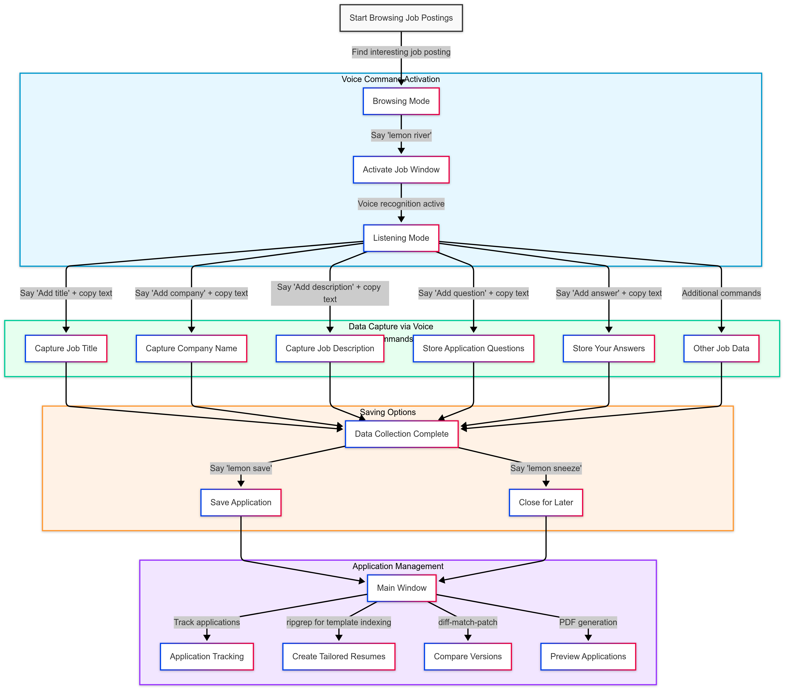
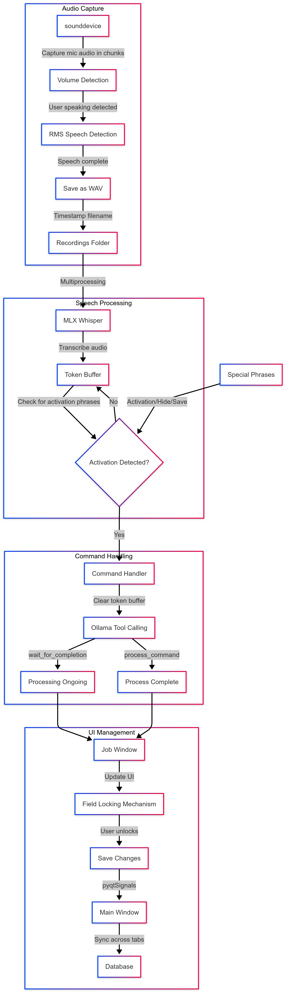

# 🍋 Lemon River

<div align="center">

[](https://opensource.org/licenses/MIT)
[](https://www.python.org/downloads/)
[](https://github.com/psf/black)
[](CONTRIBUTING.md)


*Your AI-powered companion for mindful job applications*

[Technologies](#technologies) • [Features](#features) • [Installation](#installation) • [Usage](#usage) • [File Structure](#file-structure) • [Architecture](#architecture) • [Contributing](CONTRIBUTING.md)

</div>

## Overview

Lemon River is a job application assistant that helps you manage and tailor your applications while maintaining a personal touch. Unlike automated application tools, Lemon River acts as your intelligent companion, listening for voice commands and helping you organize information as you naturally browse through job postings. It's designed to be a keyboard-driven interface for efficient workflow, with some voice commands for convenience.

The reason why I built this app is because I couldn't find a job application assistant that was both easy to use and customizable. I also wanted to learn how to build a desktop application in Python. Online solutions like Simplify are great, but it isn't customizable and I wanted to build my own. I used to keep track of my applications in a Notion page, but the app was very inefficient and I always had to switch between tabs to copy and paste information from the postings into my job application tracking table. Lemon River solves this by allowing you to capture information as you browse through job postings, and then organize it based on your voice commands while having access to your clipboard.

## Technologies

- [Ollama](https://ollama.com/) for the LLM server
- [MLX Whisper](https://github.com/ml-explore/mlx-examples) for the speech recognition
- [PyQt6](https://www.riverbankcomputing.com/software/pyqt/intro) for the UI
- [ripgrep](https://github.com/BurntSushi/ripgrep) for resume template indexing
- [diff-match-patch](https://github.com/google/diff-match-patch) for resume version control

## Features

- **Voice-Activated Workflow**: Just say "lemon river" to start capturing job details (configurable)
- **Clipboard Intelligence**: Seamlessly captures and organizes information from your clipboard based on voice commands
- **Smart Application Management**: 
  - Track application status
  - Store company details
  - Manage application Q&As
  - Keep notes and follow-ups (e.g. OA questions, interview questions, etc.)
- **Resume Tools**:
  - Create tailored resumes on your own with diffing, template selection, ripgrep search, and more
  - Compare versions
  - Preview in real-time
  - Track changes
- **Modern UI**: Beautiful, keyboard-driven interface for efficient workflow

## System Requirements

### macOS
Before running the app, grant the following permissions:
- System Preferences → Privacy & Security → Input Monitoring
- System Preferences → Security & Privacy → Full Disk Access
- System Preferences → Security & Privacy → Accessibility
- Microphone access (will be requested on first launch)

### Windows
- Not tested

### Linux
- Not tested

### Dependencies
- ollama (server must be running)
- Python 3.13+ (Haven't tested with other versions)

## Installation

1. Clone the repository
```bash
git clone https://github.com/yourusername/lemon-river.git
cd lemon-river
```

2. Install dependencies
```bash
pip install -r requirements.txt
```

3. Start the ollama server
```bash
ollama serve
# Also need to pull the model you are using
# e.g. the ones I tested with
ollama pull llama3.2
ollama pull llama3-groq-tool-use
```

4. Run Lemon River
```bash
python main.py
```

5. Kill Lemon River
```bash
# For some reason the multiprocessing library sometimes doesn't want to die, so this is more reliable
pkill -f main.py
```


## File Structure

```
lemon-river/
├── agent/                      # Voice command and processing logic
│   ├── command_handler.py      # Handles voice command interpretation and execution with LLM
│   └── voice_processor.py      # Voice command preprocessor
├── gui/                        # User interface components
│   ├── job_window.py          # Job application capture window
│   ├── main_window.py         # Main application window
│   ├── dataclasses.py         # App related data classes
│   ├── tabs/                  # Different tabs in the main window
│   └── widgets/               # Reusable UI components
├── db/                        # Database adapter, may include the db file when ran
├── docs/                      # Documentation and images
├── recordings/               # Temporary voice recording storage
├── tests/                    # Unit and integration tests
├── voice/                    # Voice processing utilities
├── main.py                   # Entry point
├── llm.py                    # LLM integration and tool calls
├── utils.py                  # Shared utility functions
└── requirements.txt          # Python dependencies
```

## Usage

<div align="center">

</div>

1. **Start Browsing**: Open job postings as you normally would
2. **Activate**: Say "lemon river" to start capturing
3. **Capture Information**: Use voice commands while copying text:
   - "Add title" - Capture job title from your clipboard
   - "Add company" - Capture company name from your clipboard
   - "Add description" - Capture job description from your clipboard
   - "Add question" - Store application questions from your clipboard
   - "Add answer" - Store your answers from your clipboard
   - And more! Check agent/command_handler.py for the full list
4. **Save**: Say "lemon save" when done, or "lemon sneeze" to close the window for later
5. **Manage**: Use the main window to:
   - Track all your applications
   - Create tailored resumes (with ripgrep for resume template indexing)
   - Compare different versions (with Google's diff-match-patch)
   - Preview applications (pdf)

## Architecture

<div align="center">

</div>

### How it works under the hood

- Uses sounddevice to capture audio from your microphone in chunks
- Detects when the user's speaking based on their volume (adjust based on your needs)
- Uses root mean squared to detect when the user is done speaking (Basically, we store the last 0.5s of speech as a chunk and compare the root mean squared of that chunk with the volume threshold. This is because the user might have brief pauses in speech, so we need to account for that)
- Saves as a wav file in a recordings folder (with a timestamp in the filename so it's easier to sort recency)
- Uses MLX Whisper to transcribe your voice commands (as a separate multiprocessing process)
- The transcription is added to a local token buffer
- If activation phrase or command is detected in the token buffer, the command handler is triggered and the token buffer is cleared
- The command handler uses ollama tool calling to handle the command, and smartly detects if the user is done speaking (wait_for_completion tool call v.s. process_command tool call)
- The command handler then returns the response to the job window, which then updates the UI
- Since LLMs are sometimes not reliable, there is a locking mechanism for each field that prevents it from being overwritten until the user unlocks it
- Very specific activation phrase, hide phrase, and save phrase since using LLMs for this is too overkill
- Job window directly updates main_window after saving, so no need to refresh
- Main window utilizes a lot of pyqtSignals to emit and listen to events to sync data between tabs and the database

## Roadmap

- [ ] Add insanely-fast-whisper for non-macOS platforms
- [ ] Cross-platform support (Windows, Linux)
- [ ] Configurable resumes path
- [ ] Custom keybindings
- [ ] Resume version control
- [ ] Better system than "Notes" for OA/Interview/Research information
- [ ] Improved ripgrep search (include file names in search)
- [ ] Configurable voice commands
- [ ] Unit and integration tests
- [ ] Better logging system
- [ ] Potential optimizations with application syncing
- [ ] Better documentation
- [ ] Build pipeline with pyinstaller (it did not work well on macOS with pyinstaller)
- [ ] Vim mode

## Contributing

I need contributions! Please see our [Contributing Guide](CONTRIBUTING.md) for details.

## License

This project is licensed under the MIT License - see the [LICENSE](LICENSE) file for details.

## Acknowledgments

- [Ollama](https://ollama.ai/) for the LLM server
- [MLX Whisper](https://github.com/ml-explore/mlx-examples) for the speech recognition
- [PyQt6](https://www.riverbankcomputing.com/software/pyqt/intro) for the UI
- [ripgrep](https://github.com/BurntSushi/ripgrep) for resume template indexing
- [diff-match-patch](https://github.com/google/diff-match-patch) for resume version control
